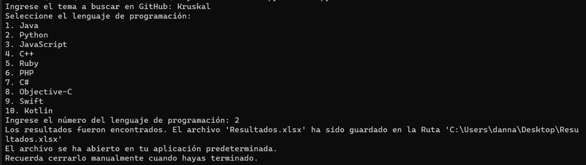
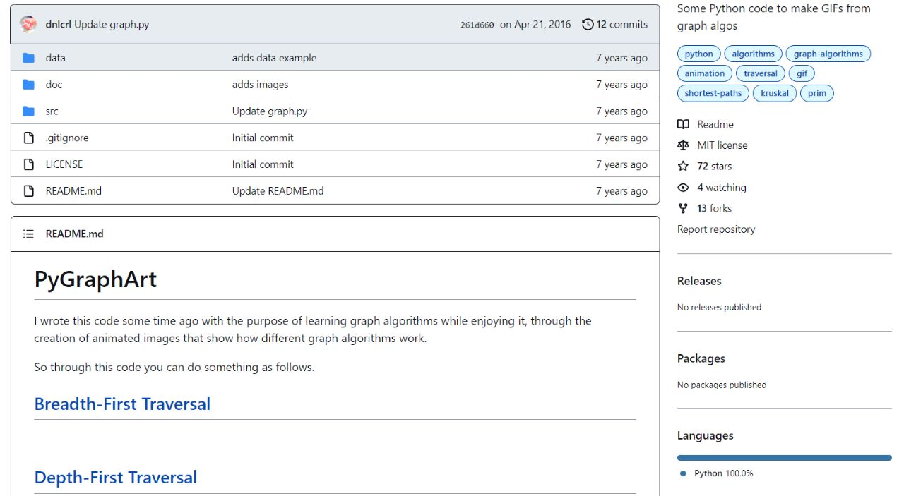

# ❌⭕ Web Crawler ❌⭕

Este proyecto es un web crawler desarrollado en Python que utiliza la API de GitHub para buscar repositorios según un tema y un lenguaje de programación específicos. Los resultados se guardan en un archivo Excel.

## Funcionalidades

- Permite ingresar un tema de búsqueda y seleccionar un lenguaje de programación.
- Realiza una solicitud a la API de GitHub y muestra los repositorios encontrados.
- Genera un archivo Excel con los detalles de los repositorios.
- Abre automáticamente el archivo Excel en la aplicación predeterminada del sistema operativo.

## Instalación

1. Clona este repositorio en tu máquina local.
2. Asegúrate de tener Python instalado en tu sistema.
3. Instala las librerías requeridas ejecutando el siguiente comando en tu terminal:

## Ejecución

1. Abre tu terminal y navega hasta la carpeta raíz del proyecto.
2. Ejecuta el siguiente comando para iniciar el programa:
3. Sigue las instrucciones en la consola para ingresar el tema de búsqueda y seleccionar el lenguaje de programación. Por ejemplo, puedes ingresar "kruskal" como tema y seleccionar "Python" como lenguaje.
4. El programa realizará una solicitud a la API de GitHub y mostrará los repositorios encontrados relacionados con el tema "kruskal" y el lenguaje "Python".
5. Los detalles de los repositorios se guardarán en un archivo Excel llamado "Resultados.xlsx" en la carpeta del proyecto.
6. Se abrirá automáticamente el archivo Excel en la aplicación predeterminada del sistema operativo.
7. En la consola, se mostrará un mensaje indicando que el archivo se ha abierto en la aplicación predeterminada.
8. Puedes revisar los repositorios, sus propietarios, URLs y puntuaciones en el archivo Excel.
9. Además, puedes hacer clic en las URLs en el archivo Excel para abrir directamente los repositorios en GitHub y obtener más información.
10. 
# 🥷🥷🥷🥷🥷🥷🥷🥷🥷🥷🥷🥷🥷🥷🥷🥷🥷🥷🥷🥷🥷

A continuación, se muestra un ejemplo de lo que puedes esperar en cada etapa:

### Consola (CMD) 📉📈 

### Archivo Excel (Resultados.xlsx) 📉📈 

| Usuario      | Repositorio   | URL                                      | Puntuación |
|--------------|---------------|------------------------------------------|------------|
| user1        | kruskal-repo1 | https://github.com/user1/kruskal-repo1    | 100        |
| user2        | kruskal-repo2 | https://github.com/user2/kruskal-repo2    | 75         |
| user3        | kruskal-repo3 | https://github.com/user3/kruskal-repo3    | 50         |
| user4        | kruskal-repo4 | https://github.com/user4/kruskal-repo4    | 25         |
| user5        | kruskal-repo5 | https://github.com/user5/kruskal-repo5    | 10         |

### GitHub 📉📈 

Al abrir los enlaces en el archivo Excel, puedes explorar los repositorios en GitHub para obtener más información, revisar el código fuente, leer documentación, etc.

---

